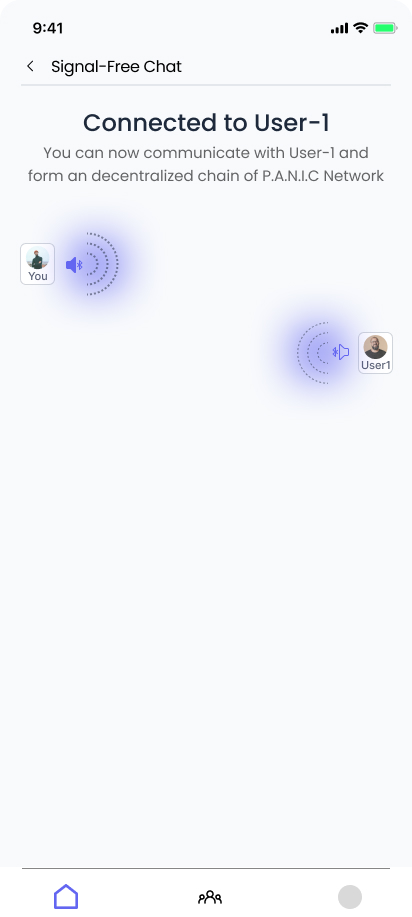

<h1 align="center">PANIC : Disaster Support & Emergency System</h1>
<h2 align="center">Personalised Ai Navigator In Crisis</h2>

<p align="center">
  <b>Empowering communities with real-time disaster response, resource sharing, and emergency communication.</b>
</p>

---

## 🚀 Overview

**PANIC** is a full-stack disaster management platform designed to help users during emergencies. It provides real-time alerts, AI-powered assistance, resource mapping, SOS features, and community support—all accessible via a modern mobile app and robust backend.

---

## 🗂️ Project Structure

```
PANIC-DSE/
│
├── backend/         # Node.js + Express REST API & WebSocket server
│   ├── controllers/ # Business logic for all features
│   ├── middleware/  # Auth and request validation
│   ├── models/      # Mongoose schemas (User, SOS, Resource, etc.)
│   ├── routes/      # API endpoints
│   ├── tests/       # API test scripts
│   ├── db.js        # MongoDB connection
│   └── server.js    # Main server entry point
│
└── frontend/        # React Native (Expo) mobile app
    ├── components/  # Reusable UI components
    ├── pages/       # App screens (Home, SOS, Chat, etc.)
    ├── styles/      # Theme and styles
    ├── assets/      # Icons and images
    └── App.js       # App entry point
```

---

## 🌟 Key Features

### 📱 Frontend (React Native + Expo)
- **Modern UI**: Clean, accessible, and mobile-first design.
- **Home Dashboard**: Quick access to alerts, resources, and features.
- **SOS Button**: Instantly send your location and message to authorities and contacts.
- **AI Chatbot**: Get disaster advice powered by Google Gemini.
- **Resource Map**: Find and share resources (water, food, shelter, etc.) nearby.
- **Signal Zero**: Bluetooth mesh simulation for offline peer-to-peer chat.
- **Community Chat**: Real-time WebSocket chat for local support.
- **Offline Guide**: Survival tips and guides accessible without internet.
- **Smart Profile**: Manage medical info and emergency contacts.

### 🛠️ Backend (Node.js + Express + MongoDB)
- **RESTful API**: Secure endpoints for authentication, resources, SOS, profiles, and more.
- **WebSocket Server**: Real-time chat and notifications.
- **AI Integration**: Google Gemini API for smart disaster Q&A.
- **Geospatial Queries**: Find resources and people near a location.
- **Authentication**: JWT-based user auth and protected routes.
- **Rate Limiting**: Prevents AI API abuse.

---

## 🧩 Tech Stack

<p align="center">
   
</p>

- **Frontend**: React Native, Expo, Styled Components, Axios
- **Backend**: Node.js, Express, Mongoose, WebSocket (ws), express-validator, dotenv
- **AI**: Google Gemini API
- **Database**: MongoDB (with geospatial indexing)
- **Testing**: Axios scripts

---

## 📦 Main Modules

### Backend
- `server.js`: Express app, WebSocket server, and route setup.
- `controllers/`: Business logic for each feature.
- `models/`: Mongoose schemas for User, SOS, Resource, LostFound, EmergencyProfile, etc.
- `routes/`: REST API endpoints.
- `middleware/authMiddleware.js`: JWT authentication.

### Frontend
- `App.js`: Navigation and screen registration.
- `pages/`: Main screens (Home, SOS, AIChatbot, SignalZero, etc.).
- `components/`: UI elements (Button, Card, NavBar, etc.).
- `styles/theme.js`: Centralized theme and color palette.

---

## 🔒 Authentication

- **Register/Login**: `/api/auth/register`, `/api/auth/login`
- **JWT**: All protected routes require `Authorization: Bearer <token>`

---

## 🌍 Geospatial Features

- **Resource & SOS location**: Stored as GeoJSON Points, indexed for fast `$near` queries.
- **Find nearby resources**: `/api/resources/nearby?lat=...&lng=...&radius=...`

---

## 🤖 AI Chatbot

- **Endpoint**: `/api/ai/prompt` (POST, protected)
- **Model**: Google Gemini (configurable via `.env`)
- **Features**: Context-aware disaster advice, location/resource-aware responses

---

## 🆘 SOS & Emergency

- **Send SOS**: `/api/sos` (POST, protected)
- **History**: `/api/sos/me` (GET, protected)
- **Status Update**: `/api/sos/:id` (PUT, protected)

---

## 🗺️ Resource Sharing

- **Add Resource**: `/api/resources` (POST, protected)
- **Get All**: `/api/resources` (GET)
- **Nearby**: `/api/resources/nearby` (GET)

---

## 🧑‍🤝‍🧑 Community & Signal Zero

- **WebSocket Chat**: Real-time, device-based chat via WebSocket (see `server.js`)
- **Signal Zero**: Simulated Bluetooth mesh for offline/peer-to-peer scenarios

---

## 🏥 Emergency Profile

- **Profile**: `/api/profile` (POST/GET, protected)
- **Fields**: Blood type, allergies, medical conditions, emergency contacts

---

## 🧪 API Testing

- Automated test script: `tests/apiTest.js`
- Covers registration, login, resources, SOS, profile, lost/found, and AI endpoints

---

## 🖼️ UI Preview

<p align="center">
  
  
  
  
  
  
</p>


---

## ⚙️ Getting Started

### 1. Backend

```bash
cd backend
npm install
cp .env.example .env  
npm start
```

### 2. Frontend

```bash
cd frontend
npm install
npx expo start -c
```

---

